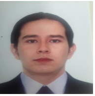

Aside
================================================================================

{width=80%}

Contacto {#contact}
--------------------------------------------------------------------------------

- <i class="fa fa-envelope"></i> edavidja@unal.edu.co
- <i class="fa fa-code"></i> [edimer.netlify.app/](https://edimer.netlify.app/)
- <i class="fa fa-github"></i> [github.com/Edimer](https://github.com/Edimer)
- <i class="fab fa-linkedin-in"></i> [Linkedin](https://www.linkedin.com/in/edimer-david-jaramillo-94a510199/)
- <i class="fab fa-stack-overflow"></i> [Stack-Overflow](https://stackoverflow.com/users/13271245/edimer-david-jaramillo)

Habilidades {#skills}
--------------------------------------------------------------------------------

- Desarrollo de productos de datos con R (dashboard, Apps, reportes automáticos).

- Construcción de modelos de machine learning e intergración en aplicativos web (Shiny Apps). 

- Experiencia en diseño y análisis estadístico de experimentos.

- Consultoría estadística aplicada en evaluaciones agronómicas, bioestadística, mercado energético, estimación de riesgo en área financiera, analítica deportiva, entre otras.

Main
================================================================================

Edimer David Jaramillo {#title}
--------------------------------------------------------------------------------

### Zootecnista, Especialista en Estadística.

Zootecnista y especialista en Estadística, con capacidad de utilizar métodos estadísticos en favor de resolver problemas específicos en múltiples áreas del conocimiento.
Experiencia en docencia universitaria, formulación de proyectos de investigación y consultoría estadística, ejerciendo funciones de análisis de datos a través de lenguajes de programación como *R* y *Python*. Participante en competencias de *Data Science* a través de plataformas como [Kaggle](https://www.kaggle.com/), [Zindi (África)](https://zindi.africa/) y [DataSource (Latinoamérica)](https://www.datasource.ai/). 

Educación {data-icon=graduation-cap data-concise=true}
--------------------------------------------------------------------------------

### Universidad Nacional de Colombia

Zootecnia

Medellín, Colombia

2009 - 2016

Tesis: Descripción de la Curva de Crecimiento en Animales Lucerna y sus Cruces, bajo la Influencia de Factores no Genéticos.

### Universidad Nacional de Colombia

Especialización en Estadística

Medellín, Colombia

2016 - 2017

Tesis: Aplicación de Modelos Lineales Generalizados en comportamiento de crecimiento de bovinos Lucerna.

Educación Complementaria {data-icon=graduation-cap data-concise=true}
--------------------------------------------------------------------------------

### DataCamp

Intermediate Python

*Online*

2022

### DataCamp

Introduction to Python

*Online*

2022

### Coursera

Spark con Databricks (Big Data)

*Online*

2021

### DataCamp

Introduction to Statistical Modeling in R

*Online*

2021

### DataCamp

Data Science for Business

*Online*

2021

### Udemy

Deep Learning con Tensorflow para Machine Learning e IA

*Online*

2020

### Coursera

Introducción a Data Science: Programación Estadística con R

*Online*

2020

### WOBI (World Of Business Ideas)

Innovación de modelos de negocio en un entorno de disrupción digital

*Online*

2020

### DataCamp

Time Series Analysis in R

*Online*

2020

### SENA-Fenavi

Big Data y CRM

Medellín, Antioquia

2019

### DataCamp

Introduction to R

*Online*

2018

Experiencia en investigación {data-icon=laptop}
--------------------------------------------------------------------------------

### Grupo de investigación

[Nutri-Solla](https://scienti.minciencias.gov.co/gruplac/jsp/visualiza/visualizagr.jsp?nro=00000000013946)

Colombia

2019 - Actual

- Investigación en nutrición animal y tecnologías disruptivas en producción pecuaria.

### Asistente de I+D

Solla S.A.

Itagüi, Colombia

2019 - 2021

- Investigación en implementación de algoritmos de *Machine Learning* para detección de mastitis en vacas del trópico alto colombiano.

### Estudiante de Zootecnia

Universidad Nacional de Colombia

Medellín, Colombia

2015 - 2016

- Investigación en métodos estadísticos alternativos para modelación de curvas de crecimiento en bovinos criollos colombianos, considerando diferentes estructuras de correlación en medidas repetidas.

Experiencia profesional {data-icon=suitcase}
--------------------------------------------------------------------------------

### Científico de Datos

Datalytics

Medellín, Colombia

2021 - Actual

::: concise
- Entrenamiento de algoritmos de machine learning con R y Python. 
- Construcción de reportes con R y Python.
- Apoyo en labores de despliegue de soluciones analíticas basadas en datos.
:::

### Analista de Datos

Grupo Éxito 

Envigado, Colombia

2021 - 2021

::: concise
- Entrenamiento de algoritmos de machine learning con R y Python. 
- Construcción de reportes con R y Python.
- Evaluación de proyectos en analítica digital. 
:::

### Asistente de I+D

Solla S.A.

Itagüi, Colombia

2019 - 2021

::: concise
- Diseño y análisis estadístico de experimentos. 
- Desarrollo de aplicativos web con *R*.
- Formulación de proyectos de investigación. 
- Análisis de información en nutrición animal.
:::

### Consultor estadístico

Premex (Asimetrix S.A.S)

Medellín, Colombia

2016 - 2019

::: concise
- Análisis estadístico de datos experimentales y observacionales.
:::

Experiencia en docencia {data-icon=chalkboard-teacher}
--------------------------------------------------------------------------------

### Diseño Experimental.

Docente del curso impartido en la Facultad de Ciencias Agrarias, en la Universidad de Antioquia.

Medellín, Colombia

2022 - 2023

### Estadística.

Docente del curso impartido en la Facultad de Ciencias Agrarias, en la Universidad de Antioquia.

Medellín, Colombia

2021 - 2022

### RProject en Experimentación Animal.

Docente del curso impartido en la Facultad de Ciencias Agrarias, en la Universidad de Antioquia.

Medellín, Colombia

2020 - 2022

### Bioestadística 1.

Docente del curso impartido en la Facultad de Ciencias Agrarias, en la Universidad Nacional.

Medellín, Colombia

2018 - 2019

### Introducción al análisis de datos con R - Nivel 1.

Instructor de curso de extensión en  en la Universidad Nacional.

Medellín, Colombia

2018 - 2019

### Introducción al análisis de datos con R - Nivel 2.

Instructor de curso de extensión en  en la Universidad Nacional.

Medellín, Colombia

2018

Eventos académicos {data-icon=file}
--------------------------------------------------------------------------------

### Asociación de parámetros zootécnicos en vacas Holstein en pastoreo a través de métodos multivariados.

Ponencia oral

Medellín, Colombia

2019 

**Edimer David Jaramillo**, Jairo Andrés Tobón Peña, Óscar David Múnera Bedoya, Luis Miguél Gómez Osorio, Alexander Balbin Feria.

### Algoritmos de Machine Learning en detección de mastitis en vacas del trópico alto Colombiano.

Ponencia oral

Madrid, España

2019 

**Edimer David Jaramillo**, Óscar David Múnera Bedoya, Óliver Restrepo, Alexander Balbin Feria, Carolina Mesa, Pablo Aguirre.

### Description of the influence of time of birth, year of birth, farm, race, and their interactions over growth in Lucerne animals breed and its crosses.

Ponencia Oral

Medellín, Colombia

2015

**Edimer David Jaramillo**, Luis Gabriel González Herrera.

### Efecto de época de nacimiento en la curva de crecimiento de la raza Lucerna, utilizando polinomios de Legendre.

Ponencia oral

Villavicencio, Colombia

2015 

**Edimer David Jaramillo**, Luis Gabriel González Herrera. 

### Descripción de la influencia de orden de parto sobre el crecimiento en animales de la raza Lucerna y sus cruces.

Ponencia oral

La Habana, Cuba

2015 

**Edimer David Jaramillo**, Luis Gabriel González Herrera. 

### Regression models to describe a growth curve in Lucerna breed and its crossbreedings.

Póster

Belo Horizonte, Brasil

2015 

**Edimer David Jaramillo**, Luis Gabriel González Herrera. 

Artículos Científicos - Libros
--------------------------------------------------------------------------------

### [Spectro-temporal acoustic elements of music interact in an integrated way to modulate emotional responses in pigs](https://doi.org/10.1038/s41598-023-30057-5)

Scientific Reports

Reino Unido

2023 

Juliana Zapata Cardona, Maria Camila Ceballos, Ariel Marcel Tarazona Morales, Edimer David Jaramillo & Berardo de Jesús Rodríguez.

--------------------------------------------------------------------------------

### [Music modulates emotional responses in growing pigs](https://doi.org/10.1038/s41598-022-07300-6)

Scientific Reports

Reino Unido

2022 

Juliana Zapata Cardona, Maria Camila Ceballos, Ariel Marcel Tarazona Morales, Edimer David Jaramillo & Berardo de Jesús Rodríguez. 

--------------------------------------------------------------------------------

### [Caracterización de Sistemas de Producción Industrial de Pollo de Engorde en el Departamento de Santander- Colombia](https://doi.org/10.22507/rli.v19n1a5)

Revista Lasallista de Investigación

Colombia

2022 

Gómez Londoño, J., Cerón-Muñoz, M.F., Duque Noreña, J.H., David Jaramillo, E., Múnera Bedoya, O.D.

--------------------------------------------------------------------------------

### [Libro - Capítulo 7. Porcípolis: una experiencia transdisciplinaria de ciencia, tecnología, arte y educación para el sector agrario](https://revistas.udea.edu.co/index.php/biogenesis/article/view/352223)

Universidad de Antioquia

Colombia

2022 

Berardo de J Rodríguez, Juliana Zapata C., Diana Margot López Herrera, Verónica Bermúdez S., Andrés Adrián Martínez Carmona, Natalia Álvarez H., Santiago Duque-Arias, Edimer David Jaramillo